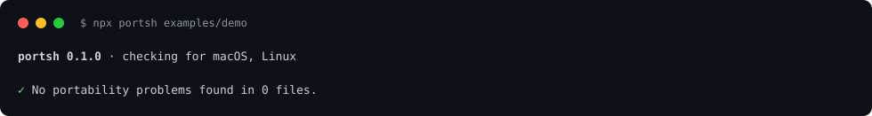

<div align="center">

# portsh

**Will this shell script run on macOS, Linux and Alpine?**<br>
Finds GNU / BSD / BusyBox differences in your scripts, Makefiles, CI workflows, Dockerfiles and READMEs, before a teammate or a CI runner does.

[](https://github.com/Nithinfgs/portsh/actions/workflows/ci.yml)
[](LICENSE)




</div>

## The 20-second version

```sh
npx github:Nithinfgs/portsh .
```

portsh reads your shell code, works out which commands and flags only exist in one userland, and tells you where each one breaks and what to write instead.

```text
✗ scripts/install.sh:9:1  sed-inplace-no-suffix  breaks on macOS
    sed -i 's/__VERSION__/'"$VERSION"'/' config/app.conf
    ^^^
    `sed -i` needs an attached suffix to work on both GNU and BSD sed
    fix: Attach a suffix and remove the backup: `sed -i.bak ... file && rm -f file.bak` works everywhere.
```

It is not a replacement for [ShellCheck](https://www.shellcheck.net/). ShellCheck finds bugs in the *shell language* (quoting, bashisms). portsh finds bugs in the *tools you call*: the script is valid shell, and still fails on the other half of your team's machines.

## Why this exists

`sed -i 's/a/b/' file` works on every Linux box and fails on every Mac. So do `grep -P`, `date -d`, `stat -c`, `find -printf`, `readlink -f` (on older macOS), `xargs -d`, `head -n -1`, `mapfile`, and a long tail of others. They get written by people on one OS (or by an AI assistant that defaults to GNU flags), pass CI on one OS, and break on the other.

Nothing in the usual toolbox catches this class of bug before it ships: `shellcheck` is about the language, `checkbashisms` is about POSIX sh versus bash. portsh fills that gap and is built around three ideas:

1. **Understand the code, not the text.** A real shell tokenizer skips comments, strings and heredocs, and looks inside `$(...)`, `xargs`, `find -exec` and `sh -c`.
2. **Respect what the author already handled.** `if [ "$(uname)" = Darwin ]`, `case "$OSTYPE"`, `cmd || fallback`, and `command -v tool` all scope or silence a finding. `runs-on: ubuntu-latest` and `FROM alpine` decide which platform a step is judged against.
3. **Every claim is executable.** Each rule ships a snippet that breaks and a portable replacement. `portsh verify` runs them on your machine, and CI runs them on macOS, Ubuntu and Alpine, so a rule that stops being true (Apple fixed it) fails the build instead of silently lying.

## Quick start

No install needed (Node 18+):

```sh
npx github:Nithinfgs/portsh .            # scan the current directory
npx github:Nithinfgs/portsh scripts/ Makefile
cat setup.sh | npx github:Nithinfgs/portsh --stdin
```

portsh has no runtime dependencies and no build step. The package is also ready for the npm registry (`npx portsh`) once it is published.

Pick the platforms you care about:

```sh
portsh . --targets macos,linux,alpine
```

### In CI

```yaml
- uses: actions/checkout@v4
- run: npx github:Nithinfgs/portsh . --format github   # inline annotations on the PR
```

`--format sarif` produces a report for GitHub code scanning. The exit code is `1` when problems are found.

## What it checks

| It reads | How |
| --- | --- |
| Shell scripts | `*.sh`, `*.bash`, `*.zsh`, and extensionless files with a shell shebang |
| Makefiles | recipe lines, with `ifeq ($(UNAME_S),Darwin)` blocks honoured |
| GitHub Actions | `run:` steps, judged against the job's `runs-on`, `matrix.os`, `container` and `if: runner.os == ...` |
| Dockerfiles | `RUN` lines, judged against each stage's `FROM` (Alpine vs Debian-family) |
| `package.json` | the `scripts` field |
| Markdown | fenced `sh`/`bash`/`console` blocks (missing-command rules are skipped in prose) |

**95 rules** in four groups, listed in [docs/rules.md](docs/rules.md):

- **Flags that differ**: `sed -i`, `sed` GNU escapes (`\s`, `\w`), `grep -P`, `date -d` / `date -v`, `stat -c` / `stat -f`, `find -printf`, `xargs -d`, `head -n -N`, `mktemp -t`, `tail -r`, `base64 -D`, `install -D`, `ln -r`, `getopt`, gawk-only `awk` functions, and GNU long options on tools whose BSD versions accept none.
- **Commands that are missing**: `nproc`, `timeout`, `tac`, `shuf`, `free`, `ip`, `apt-get` on Mac and Alpine; `pbcopy`, `open`, `sw_vers`, `launchctl` on Linux; Homebrew's `gsed`/`gdate` anywhere else.
- **Bash 3.2 on macOS**: `mapfile`, `declare -A`, `${v,,}`, `${arr[-1]}`, `&>>`, `wait -n`, `[[ -v x ]]`, `$EPOCHSECONDS`.
- **`sh` pitfalls**: `echo -e` under `/bin/sh`.

Run `portsh rules` for the list and `portsh explain sed-inplace-no-suffix` for any rule's reasoning and a before/after example.

## Example

Given this script:

```bash
#!/usr/bin/env bash
JOBS=$(nproc)
VERSION=$(grep -oP 'version = "\K[^"]+' Cargo.toml)
sed -i 's/__VERSION__/'"$VERSION"'/' config/app.conf

if [[ "$OSTYPE" == "darwin"* ]]; then
  pbcopy < manifest.txt
else
  xclip -selection clipboard < manifest.txt
fi
```

portsh reports `nproc`, `grep -P` and `sed -i`, and leaves the `pbcopy` / `xclip` branches alone because each is guarded for the platform it runs on. A runnable project that exercises every file type lives in [examples/demo](examples/demo): `npx github:Nithinfgs/portsh examples/demo`.

## Verify the rules on your machine

```sh
portsh verify
```

```text
portsh verify on macOS

177 passed, 0 failed, 1 skipped
```

Each probe runs a tiny snippet in a temporary directory and checks that it fails exactly where the rule says it does, works everywhere else, and that the recommended replacement works on all platforms. If your OS has fixed something, a rule fails here first, and you will know.

## How it works

```text
files ──► extractors ──► shell chunks ──► parser ──► rules ──► findings ──► reporters
          (script, Make,    + where each    commands,   95 rules     scoped to    text, json,
           workflow,         line came      platform    each with    platforms    sarif, github
           Dockerfile,       from, and      conditions  a probe      in play
           Markdown, npm)    target OS      fallbacks
```

See [docs/architecture.md](docs/architecture.md) for the details.

## Configuration

`.portshrc.json` (or a `"portsh"` key in `package.json`):

```json
{
  "targets": ["macos", "linux", "alpine"],
  "disable": ["bash4-mapfile"],
  "exclude": ["vendor/**"],
  "overrides": [{ "files": ["plugins/macos/**"], "targets": ["macos"] }],
  "failOn": "error"
}
```

- `targets` defaults to `macos, linux`. Dockerfiles and CI jobs use the platform they actually run on.
- Files whose path names a platform (`install-macos.sh`, `plugins/archlinux/`) are checked against that platform only. `--no-path-hints` turns this off.
- Silence one finding with a trailing `# portsh-ignore <rule-id>` comment, the next line with a comment above it, or a whole file with `# portsh-ignore-file`.
- Flags: `--targets`, `--format text|json|sarif|github`, `--fail-on error|warn|none`, `--disable`, `--exclude`, `--stdin`.

As a library:

```js
import { lintPaths } from 'portsh';
const report = lintPaths(['scripts/'], { targets: ['macos', 'linux'] });
```

## Limitations

- It is a static analyzer. It does not run your script, so it cannot know a variable holds `sed` or that a branch is dead. When it cannot tell, it errs towards staying quiet (guards and fallbacks suppress findings), so absence of findings is not proof of portability.
- It targets Linux with GNU coreutils (Debian/Ubuntu class), current macOS, and Alpine's BusyBox. Other BSDs, Solaris and Windows shells are out of scope.
- Rules are verified against recent releases of those systems. Old macOS versions (before 12.3, for instance, `readlink -f`) may behave differently.
- The shell parser is forgiving rather than complete: it does not expand variables, aliases or `eval` with computed strings.
- There is no autofix yet; findings include the replacement to write.

## Roadmap

- `--fix` for the mechanical rewrites (`sed -i`, `stat -c %s`, `grep -P` simple cases)
- Alpine "installed by default" rules (`curl`, `bash`, `git` missing unless `apk add`ed in the same stage)
- Windows (Git Bash) target
- A pre-commit hook and a ready-made GitHub Action
- More rules: contribute one, see below

## Contributing

Adding a rule is a small, self-contained change: a matcher, a `probe`, and `npm run docs`. See [CONTRIBUTING.md](CONTRIBUTING.md). If portsh flagged something that works, or missed something that breaks, [open an issue](https://github.com/Nithinfgs/portsh/issues/new/choose) with the output of `portsh verify --rule <id>`.

## License

[MIT](LICENSE)
